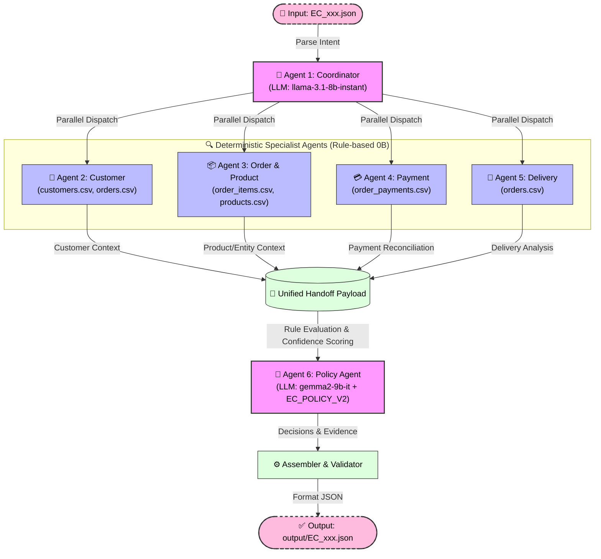

# Multi-Agent Architecture Documentation

## 1. Architecture Overview

Hệ thống xử lý khiếu nại thương mại điện tử (E-commerce Dispute Resolution) được thiết kế theo kiến trúc **Multi-Agent** phân cấp:
- **Agent 1 (Coordinator Agent)** đóng vai trò Supervisor điều phối toàn bộ pipeline, trích xuất Intent thông qua LLM (`llama-3.1-8b-instant`), gọi các Specialist Agents và tổng hợp output.
- **Agent 2-5 (Domain Specialist Agents)** truy xuất dữ liệu Olist bằng mã Python Deterministic (0B Parameter) để đảm bảo không bị hallucination trong tính toán số liệu tài chính và thời gian.
- **Agent 6 (Policy Agent)** kiểm định các quy tắc nghiệp vụ theo chuẩn `EC_POLICY_V2` và cân chỉnh điểm tin cậy `confidence` bằng LLM (`gemma2-9b-it`).

---

## 2. Danh sách Agent, Vai trò và Quyền truy cập Dữ liệu

| Agent Name | LLM Model | Param Size | Quyền truy cập Dataset | Vai trò & Nhiệm vụ chính |
|---|---|---|---|---|
| **Agent 1: Coordinator Agent** | `llama-3.1-8b-instant` | 8B | `input/EC_*.json` | Điều phối workflow, phân tích Intent khiếu nại bằng LLM, kích hoạt sub-agents và assembling output JSON. |
| **Agent 2: Customer Agent** | None (Deterministic) | 0B | `customers.csv`, `orders.csv` | Tra cứu `customer_unique_id`, lịch sử mua hàng (`related_order_ids`), phát hiện `repeat_customer`. |
| **Agent 3: Order & Product Agent** | None (Deterministic) | 0B | `order_items.csv`, `products.csv`, `sellers.csv` | Trích xuất danh sách Item ID, Product ID, Seller ID, tên danh mục tiếng Anh (`category_names`). |
| **Agent 4: Payment Agent** | None (Deterministic) | 0B | `order_payments.csv`, `order_items.csv` | Đối soát tài chính: tính tổng `payment_value` vs `expected_total_brl` (`item + freight`) với sai số $\le 0.10$ BRL. |
| **Agent 5: Delivery Agent** | None (Deterministic) | 0B | `orders.csv`, `order_items.csv` | Phân tích mốc thời gian: `delivery_variance_hours` và `handoff_variance_hours` cho từng seller. |
| **Agent 6: Policy Agent** | `gemma2-9b-it` | 9B | Handoff payloads từ Agent 2-5 | Áp dụng ưu tiên `EC_POLICY_V2`, xác định `primary_issue`, `secondary_issues`, `refund`, `actions`, `evidence_ids`. |

---

## 3. Luồng Handoff (Handoff Flow)

1. **Step 1 (Input & Intent)**: `Coordinator` nhận file `EC_xxx.json`, gọi `llama-3.1-8b-instant` để phân tích ngữ khí khiếu nại của khách.
2. **Step 2 (Data Retrieval)**: `Coordinator` song song gọi:
   - `CustomerAgent.run(order_id)` $\rightarrow$ trả về `customer_context`
   - `OrderProductAgent.run(order_id)` $\rightarrow$ trả về `product_context` & entity IDs
   - `PaymentAgent.run(order_id)` $\rightarrow$ trả về `payment_reconciliation`
   - `DeliveryAgent.run(order_id)` $\rightarrow$ trả về `delivery_analysis`
3. **Step 3 (Policy Decision)**: `Coordinator` chuyển toàn bộ kết quả của Agent 2-5 cho `PolicyAgent`. `PolicyAgent` dùng bảng ưu tiên `EC_POLICY_V2` kết hợp `gemma2-9b-it` để quyết định số tiền bồi thường và các hành động xử lý.
4. **Step 4 (Validation & Output)**: `Coordinator` kiểm tra array limits (max 5 order, 5 item, 3 seller,...), loại bỏ null handling bất hợp lý và xuất file `output/EC_xxx.json`.

---

## 4. Tuân thủ Quy định Đề bài

- **Giới hạn Model**: Cả 2 LLM Agent đều dùng mô hình dưới 10B parameters (`8B` và `9B`).
- **Xử lý Null**: Với các đơn không có item row (như order status `unavailable`), các trường `expected_total_brl`, `difference_brl`, `reconciled` được thiết lập chính xác là `null`.
- **Evidence IDs**: 100% bằng chứng thu thập đều tuân theo chuẩn `order:<id>`, `item:<id>:<seq>`, `payment:<id>:<seq>`, `seller:<id>`, `policy:<root_cause_code>`.
