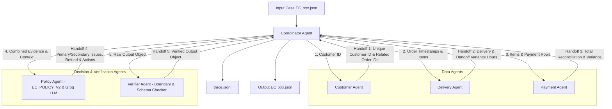

# Multi-Agent Architecture & Handoff Flow

Hệ thống điều tra khiếu nại thương mại điện tử (Olist Dispute Resolution) được thiết kế theo kiến trúc **Multi-Agent** chuyên biệt hóa vai trò, đảm bảo phân công, truyền nhận bằng chứng (handoff) và kiểm chứng độc lập.

## 1. Sơ đồ Kiến trúc & Luồng Handoff

## 2. Vai trò & Quyền truy cập dữ liệu của từng Agent

| Agent | Vai trò chính | Dữ liệu truy cập (Data Scope) | Handoff Output |
| :--- | :--- | :--- | :--- |
| **Coordinator Agent** | Nhận case, điều phối quy trình 5 bước, thu thập bằng chứng và ghi vết `trace.jsonl`. | `input/EC_xxx.json`, `output/` | Trái tim điều phối hệ thống. |
| **Customer Agent** | Truy vết danh tính khách hàng & kiểm tra lịch sử đơn hàng trước đây. | `olist_customers_dataset.csv`, `olist_orders_dataset.csv` | `customer_unique_id`, `related_order_ids`, `is_repeat_customer`. |
| **Delivery Agent** | Phân tích chênh lệch giao hàng (`delivery_variance_hours`) và từng seller bàn giao (`handoff_variance_hours`). | `olist_orders_dataset.csv`, `olist_order_items_dataset.csv` | `delivered_at`, `estimated_delivery_at`, `seller_handoff_analysis`, `late_handoff_seller_ids`. |
| **Payment Agent** | Tính tổng giá trị đơn, tổng tiền ship, tổng thanh toán và kiểm tra đối soát (`reconciled`). | `olist_order_items_dataset.csv`, `olist_order_payments_dataset.csv` | `item_total_brl`, `freight_total_brl`, `expected_total_brl`, `difference_brl`, `reconciled`. |
| **Policy Agent** | Áp dụng chính xác bảng quy tắc `EC_POLICY_V2` + Gọi LLM (`llama-3.1-8b-instant`) kiểm định lập luận. | Toàn bộ Handoff Results từ Customer, Delivery, Payment Agent | `primary_issue`, `secondary_issues`, `cause_code`, `responsible_parties`, `refund`, `actions`. |
| **Verifier Agent** | Đảm bảo tính hợp lệ của Schema JSON, cắt giới hạn độ dài mảng (max 5 order, 5 item, 3 seller, v.v.), kiểm tra ID. | Output JSON draft từ Policy Agent | JSON chuẩn hóa hoàn toàn trước khi lưu file. |

## 3. Quy trình Kiểm chứng & Đảm bảo Chất lượng (Verification & Safety)

1. **Khả năng kiểm chứng bằng chứng (Verifiable Evidence)**: Tất cả Evidence ID (`order:...`, `item:...`, `payment:...`, `seller:...`, `policy:...`) đều được sinh trực tiếp từ dữ liệu thực tế.
2. **Không ảo tưởng sự kiện (Hallucination Prevention)**: Dữ liệu thời gian và số tiền được tính toán chính xác tuyệt đối qua Python Pandas trước khi truyền sang LLM.
3. **Mô hình tuân thủ quy chế**: Hệ thống chỉ dùng mô hình **Groq `llama-3.1-8b-instant` (8B parameters $\le$ 10B)**.
